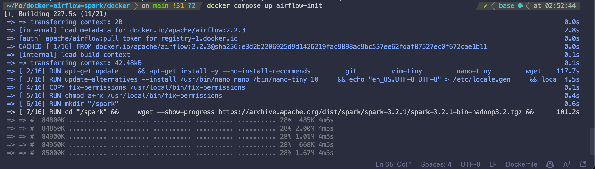
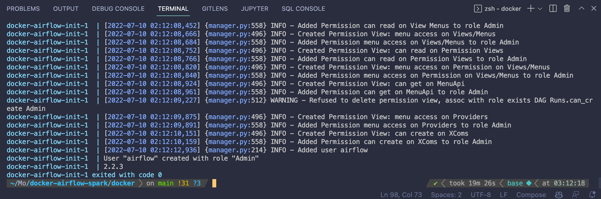

# Airflow/Spark Dockerfile

## Dockerfile: Build the Image.
- A `Dockerfile`  is a text document that contains all the commands a user could call on the command line to assemble an image. 

- `Dockerfile` that contians installations of `JAVA-JDK.v11`, `ApacheSpark.v3.2.0`, `Hadoop.v3.2`, & other dependencies built on top of `Airflow.v.2.2.3`.

- `Dockerfile` is a `.dockerfile` file that contains the instructions to build the image.
    
- It will take about ***10minutes*** to build, depending on yor internet speed / platform you use to build the image.

- Run the following command to build the image:

```
docker build --rm --force-rm -t oasis/airflow-spark . 
```

## Starting Services

## `Airflow initdb` : Initialize Airflow database.
- `airflow initdb` is a command that initializes the Airflow database.

- You must run this `once` before you can get started. This is the initial bootstrap process. 

- You will see a bunch of debug logging during this process. You can scroll through this to see what the initalization process is doing. 

- Ultimately, this process is in charge of running the database setup work and migrations, bootstrapping and all initalization scripts. 

- This is essentially, everything you need to get up and running on Apache Airflow.

- Run the following command to run the init:

~~~
docker-compose up airflow-init
~~~

- output:



- This will create the Airflow database and the Airflow USER. 

- Once we have the Airflow database and the Airflow USER, we can start the Airflow services:



<br>

## Starting Airflow Service.
After running airflow-init & pulling the necessary images, you're ready to rock n roll. 

- Navigate to the `present working directory` directory:

- Run the following command to start the services:

~~~
docker compose up -d
~~~

To ensure the services are running, you can click on the following URL:

## Airflow: http://localhost:8088

Airflow UI Login: 
* username: airflow 
* password: airflow


## Postgres
- Access to the Postgres database is available using the following command:

```
docker exec -it postgres psql -U airflow

```